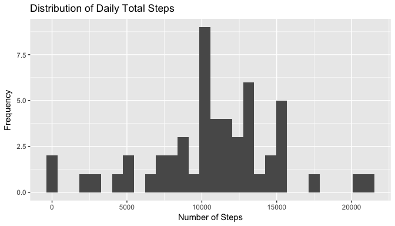
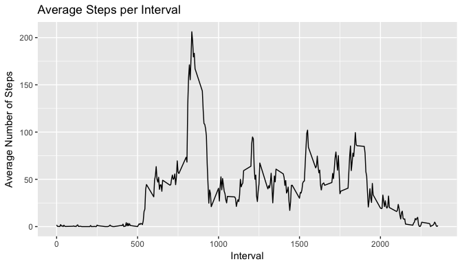
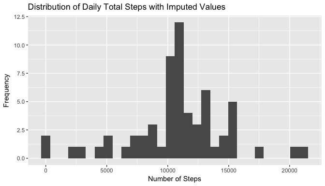
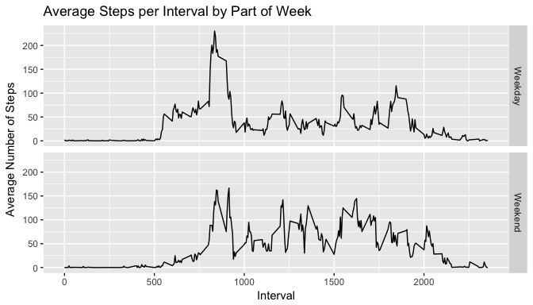
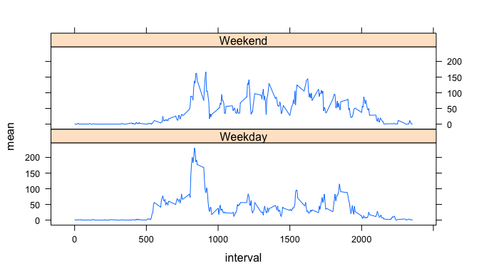

# Reproducible Research: Peer Assessment 1


## Loading and preprocessing the data
To set up the environment for analysis, the following packages need to be loaded:

```r
library(dplyr)
```

```
## 
## Attaching package: 'dplyr'
```

```
## The following objects are masked from 'package:stats':
## 
##     filter, lag
```

```
## The following objects are masked from 'package:base':
## 
##     intersect, setdiff, setequal, union
```

```r
library(ggplot2)
library(lattice)
```
For the first couple of questions to answer a table with the NAs removed from the variable **steps** needed to be created. 


```r
# Read in the CSV file
actData <- read.table("activity.csv", sep = ",", header = TRUE)

# Subset values on NA 
actData_noNA <- filter(actData, !is.na(steps))
```
## What is mean total number of steps taken per day?
To answer this question the data set with the NAs filtered out is first grouped by the variables date. The **steps** are then summed for every *date*.

```r
# Keep only steps and date
actData_sub1 <- select(actData_noNA, steps, date)

# Group data by date and summarize
actData_gb1 <- group_by(actData_sub1, date)
sum_steps <- summarize(actData_gb1, sum=sum(steps))
```
Next, a histogram is created of the total number of steps taken each day.

```r
# Plot daily number of steps
g <- qplot(data = sum_steps, sum)
g + ggtitle("Distribution of Daily Total Steps") + labs(x = "Number of Steps", y = "Frequency")
```

```
## `stat_bin()` using `bins = 30`. Pick better value with `binwidth`.
```


The mean and median values of the steps are then computed:

```r
mean_daily_steps <- format(mean(sum_steps$sum), digits=7, nsmall=2, big.mark =",")
median_daily_steps <- format(median(sum_steps$sum), digits=7, nsmall=2, big.mark =",")
```
 
The **mean** total number of steps taken a day is: 10,766.19. The **median** total number of steps taken a day is: 10,765.

## What is the average daily activity pattern?

To answer this question some pre-processing was performed:

```r
# Keep only steps and date
actData_sub2 <- select(actData_noNA, steps, interval)
```
This time the data was grouped by the interval and the average number of steps was taken for each interval.

```r
# Group data by date and summarize
actData_gb2 <- group_by(actData_sub2, interval)
mean_interval <- summarize(actData_gb2, mean=mean(steps))
```
A time series plot was created to show the change in mean steps for each interval of the day.

```r
# Plot average steps over interval
g <- ggplot(mean_interval, aes(interval, mean))
g + geom_line() + ggtitle("Average Steps per Interval") + labs(x = "Interval", y = "Average Number of Steps")
```



To find the 5-minute interval with the largest average steps, the following code was executed:

```r
max_row <- filter(mean_interval, mean == max(mean_interval$mean))
max_interval <- c(max_row[1,1])
```

The 5-minute interval with the maximum number of steps is: 835.

## Imputing missing values

The first step in this section was to find the total number of missing values.

```r
#Number of missing values
num_na <- sum(is.na(actData$steps))
```

The total number of missing values is: 2304.

The method of imputation that was chosen was to use the average interval value for those intervals that had missing data. In order to bring those values into the data set, the observation that had missing steps needed to first be identified. After identifying those values, the table with the average steps per interval was then joined to it.


```r
# Observations with missing values
actData_NA <- filter(actData, is.na(steps))
actData_NA_sub <- select(actData_NA, date, interval)

# Use mean of interval values to impute missing 
actData_NA_imputed <- merge(actData_NA_sub, mean_interval, by.x="interval", by.y="interval")
names(actData_NA_imputed) <- c("interval", "date", "steps")

# Bring imputed data and non-NA data together
all_data <- rbind(actData_noNA, actData_NA_imputed)

# Group data together for summarization and plotting
allData_gb <- group_by(all_data, date)
all_sum_steps <- summarize(allData_gb, sum=sum(steps))
```

Next, a histogram is created of the total number of steps taken each day.

```r
# Plot daily number of steps
g <- qplot(data = all_sum_steps, sum)
g + ggtitle("Distribution of Daily Total Steps with Imputed Values") + labs(x = "Number of Steps", y = "Frequency")
```

```
## `stat_bin()` using `bins = 30`. Pick better value with `binwidth`.
```



```r
all_mean_daily_steps <- format(mean(all_sum_steps$sum), digits=7, nsmall=2, big.mark =",")
all_median_daily_steps <- format(median(all_sum_steps$sum), digits=7, nsmall=2, big.mark =",")
```
The **mean** total number of steps taken a day is: 10,766.19. The **median** total number of steps taken a day is: 10,766.19.

These **mean** values are not different than those with the NA values removed from the analysis. The **median** values are different - in the recent analysis the median value now equals the mean.

## Are there differences in activity patterns between weekdays and weekends?

There was a some pre-processing that needed to occur prior to running the analysis. The code shown below mapped the day of week to whether it was a weekday or weekend. 


```r
weekdays <- c("Monday", "Tuesday", "Wednesday", "Thursday", "Friday", "Saturday", "Sunday")
time_of_wk <- c("Weekday","Weekday","Weekday","Weekday","Weekday","Weekend","Weekend")
to_assign_part_of_wk <- as.data.frame(cbind(weekdays, time_of_wk))
names(to_assign_part_of_wk) <- c("day_of_wk", "part_of_wk")
```

A new variable was added to the table - **day_of_wk**. This variable is a factor variable.

```r
part_of_wk1 <- mutate(all_data, day_of_wk = weekdays(as.Date(date)))
part_of_wk2 <- merge(part_of_wk1, to_assign_part_of_wk, by.x = "day_of_wk", by.y = "day_of_wk")

# Group data by date and summarize
part_of_wk_gb <- group_by(part_of_wk2, part_of_wk, interval)
mean_part_of_wk <- summarize(part_of_wk_gb, mean=mean(steps))
```

Two plots were created - not sure how literal the request for "...see an example of what this plot should look like..." should be taken. I thought the plot produced by ggplot2 looks better but both are provided.


```r
g1 <- ggplot(mean_part_of_wk, aes(x=interval, y=mean))
g1 + geom_line() + facet_grid(part_of_wk ~ .) + ggtitle("Average Steps per Interval by Part of Week") + labs(x = "Interval", y = "Average Number of Steps")
```




```r
# To look like the image
xyplot(mean ~ interval | part_of_wk, data = mean_part_of_wk, layout = c(1,2), type="l")
```



As indicated by the plots, there is a difference in activity between weekdays and weekends.
